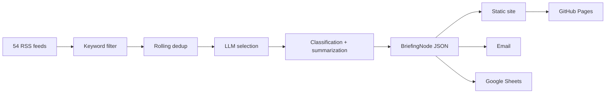

<div align="center">

# Game Legal Briefing

**Open-source regulatory intelligence for the game industry**

<p>
  
  
  
  
</p>

**[Quick Start](#quick-start)** · **[Architecture](#architecture)** · **[Deployment](#deployment)** · **[Roadmap](#roadmap)**

**Language:** [**English**](README.md) | [한국어](docs/ko/README.md)

</div>

---

## What This Does

Collects articles from 54 RSS feeds across game industry media, tech policy outlets, Korean tech press, and BigLaw blogs. Filters for legal and regulatory relevance, deduplicates, classifies each article with structured metadata using AI (Gemini), summarizes in Korean, and publishes as a static briefing site with email delivery.

> [!IMPORTANT]
> This is not legal advice. It is an open-source tool for structured regulatory monitoring.

## Why

Enterprise RegTech (CUBE, Regology, Compliance.ai) costs $50k-$500k+/year and targets banks and pharma. No open-source tool exists for game industry lawyers tracking regulatory changes across jurisdictions.

Most news briefers stop at headlines and summaries. This project attaches **structured legal metadata** to every article:

| Field | Example |
|-------|---------|
| Jurisdiction | EU, KR, US, JP, UK, AU, CN |
| Category | Consumer monetization, age rating, privacy, IP |
| Regulatory phase | Proposed, public comment, enacted, enforced, litigation |
| Actors | EU Commission, Nintendo, FTC |
| Game mechanic | Loot box, age rating, data collection |

Over time, this turns a mailing list into a searchable regulatory archive for the game industry.

## Status

> [!NOTE]
> The MVP is complete and locally runnable.
>
> **Done:** Config, data models, feed ingestion, keyword filtering, dedup, LLM abstraction (Gemini/Claude), classification, summarization, JSON storage, static rendering, email/Sheets delivery, GitHub Actions workflow, sample data mode.
>
> **Remaining:** First secrets-backed production run, GitHub repo publish, tier_c non-RSS scrapers.

## Pipeline



## Sample Briefing Node

```json
{
  "category": "CONSUMER_MONETIZATION",
  "summary_ko": [
    "EU에서 루트박스 규제 관련 움직임이 포착됐다.",
    "게임사 실무에 미칠 영향과 후속 집행 가능성을 함께 볼 필요가 있다.",
    "원문 확인 후 대응 우선순위를 정리하기 좋은 이슈다."
  ],
  "event": {
    "jurisdiction": "EU",
    "event_type": "legislation",
    "regulatory_phase": "enacted",
    "actors": ["EU regulators"],
    "object": "loot box mechanics",
    "action": "advanced or published new rules",
    "game_mechanic": "loot_box"
  }
}
```

## Quick Start

### 1. Install

```bash
python3 -m venv .venv
./.venv/bin/pip install -r requirements.txt
```

### 2. Environment variables

```bash
cp .env.example .env
# Fill in your API keys, or skip this and use sample mode first
```

### 3. Generate a sample briefing

```bash
./.venv/bin/python main.py --dry-run --sample-data
```

### 4. View the output

- `output/index.html` — Latest briefing
- `output/archive/index.html` — Date-based archive
- `output/article/*.html` — Article detail pages
- `output/data/daily/*.json` — Structured data

### Running the real pipeline

With environment variables set:

```bash
./.venv/bin/python main.py          # Full run (email + Sheets)
./.venv/bin/python main.py --dry-run # Site only, no email/Sheets
```

## Configuration

**config.yaml** — Committed to repo (no secrets):
- LLM provider/model, RSS feed lists, keyword allowlist
- Dedup retention window, site base URL, email subject prefix

**Environment variables** — `.env` or GitHub Secrets:

| Variable | Purpose |
|----------|---------|
| `GOOGLE_API_KEY` | Gemini API |
| `ANTHROPIC_API_KEY` | Claude API (optional fallback) |
| `SMTP_USER` / `SMTP_PASS` | Gmail delivery |
| `RECIPIENTS` | Comma-separated email list |
| `GOOGLE_SHEETS_CREDENTIALS` | Sheets service account JSON |
| `GOOGLE_SHEETS_ID` | Sheets spreadsheet ID |

## Architecture

```text
game-legal-briefing/
├── main.py                 # Pipeline entry point
├── config.yaml             # Non-secret config
├── pipeline/
│   ├── sources/            # RSS collection, keyword filter
│   ├── intelligence/       # Selection, classification, summarization, dedup
│   ├── llm/                # Provider abstraction (Gemini/Claude)
│   ├── store/              # JSON storage, dedup index, query
│   ├── render/             # Site + email rendering
│   ├── deliver/            # SMTP delivery
│   └── admin/              # Google Sheets sync
├── templates/              # Jinja2 templates
├── static/                 # CSS
├── tests/                  # pytest
└── output/                 # Generated site + data
```

## Deployment

A GitHub Actions workflow runs automatically on **Mon/Wed/Fri**:

1. Runs the pipeline
2. Commits structured JSON data to `main`
3. Deploys rendered HTML to GitHub Pages via artifact upload

JSON archives stay in git history. HTML is only deployed to Pages, keeping the repo lean.

## Design

Editorial briefing aesthetic, not a SaaS dashboard:
- Warm ivory background (#FAFAF8)
- Clean typography, mobile-first (720px max)
- Category chips, jurisdiction tags, regulatory phase badges
- Archive-first navigation

## Tests

```bash
./.venv/bin/python -m pytest tests -q               # Unit tests
./.venv/bin/python main.py --dry-run --sample-data   # Integration check
```

## Roadmap

| Stage | Focus |
|:------|:------|
| **Now** | GitHub publish, secrets wiring, first live run |
| **Next** | Tier_c scrapers for government sites without RSS |
| **Later** | English summaries, topic timelines, Jurisdiction Pulse dashboard |
| **Future** | Cross-jurisdiction event linking, per-topic/phase feeds |

## License

Apache 2.0
