<div align="center">

# Game Legal Briefing

**Open-source regulatory intelligence for the game industry**

<p>
  
  
  
  
</p>

**[Self-Host](#self-host)** · **[Architecture](#architecture)** · **[Roadmap](#roadmap)**

**Language:** [**English**](README.md) | [한국어](docs/ko/README.md)

</div>

---

## What This Does

Collects articles from 54 RSS feeds across game industry media, tech policy outlets, Korean press, and BigLaw blogs. It selects up to 10 articles with a verified game-law nexus, classifies and summarizes them in Korean, deploys a static archive, and only then performs optional email and Sheets delivery.

> [!IMPORTANT]
> This is not legal advice. It is an open-source tool for structured regulatory monitoring.

## Why

Enterprise RegTech (CUBE, Regology, Compliance.ai) costs $50k-$500k+/year and targets banks and pharma. No open-source tool exists for game industry lawyers tracking regulatory changes across jurisdictions.

Most news briefers stop at headlines and summaries. This project attaches **structured legal metadata** to every article:

| Field | Example |
|-------|---------|
| Jurisdiction | EU, KR, US, JP, UK, AU, CN |
| Category | Consumer monetization, age rating, privacy, IP |
| Regulatory phase | Proposed, public comment, enacted, enforced, litigation |
| Event Key | `eu_lootbox_transparency_directive_2026` |
| Game mechanic | Loot box, age rating, data collection |

Over time, this turns a mailing list into a searchable regulatory archive for the game industry.

## Self-Host

Want to fork this project and run your own briefing pipeline? Follow the steps below.

### 1. Install

```bash
git clone https://github.com/lowtidebuild/legal-briefing.git
cd legal-briefing
python3 -m venv .venv
source .venv/bin/activate
python3 -m pip install --require-hashes -r requirements.lock
```

### 2. Try with sample data first

No API keys needed:

```bash
python3 main.py --dry-run --sample-data --delivery none
open output/index.html
```

### 3. Set up API keys

```bash
cp .env.example .env
```

Edit `.env` and fill in the values:

| Variable | Purpose | Required |
|----------|---------|----------|
| `GOOGLE_API_KEY` | Gemini API key ([get one](https://aistudio.google.com/app/apikey)) | **Yes** |
| `GROQ_API_KEY` | Groq API key (optional provider configuration) | No |
| `ANTHROPIC_API_KEY` | Claude API key (legacy configuration only) | No |
| `SMTP_USER` | Gmail address (e.g., `you@gmail.com`) | For email |
| `SMTP_PASS` | Gmail app password (16 chars, keep spaces) | For email |
| `RECIPIENTS` | Comma-separated recipient emails | For email |
| `GOOGLE_SHEETS_CREDENTIALS` | Sheets service account JSON | For Sheets |
| `GOOGLE_SHEETS_ID` | Spreadsheet ID | For Sheets |

> **Only `GOOGLE_API_KEY` is required for the current LLM configuration.** The pipeline uses Gemini 3.5 Flash (`low` for selection/classification, `minimal` for summaries) and falls back to Gemini 3.1 Flash-Lite. Calls are batched to stay within free-tier limits. Email and Sheets are separate post-deploy stages and are skipped when not configured.

### 4. Run

Generation never sends email or writes Sheets:

```bash
python3 main.py --delivery none
```

After the generated run has been committed and GitHub Pages has succeeded, the workflow runs the immutable delivery command. Manual delivery is an operator recovery action; see [the operations runbook](docs/operations-runbook.md).

Output:
- `output/index.html` — Latest briefing
- `output/archive/` — Date-based archive
- `output/article/` — Article detail pages
- `output/data/daily/*.json` — Structured data
- `output/data/run_manifests/*.json` — Immutable content hashes used for delivery
- `output/data/runs/*.json` — Sanitized source, LLM, quality, and stage reports
- `output/data/delivery_receipts/*.json` — Idempotent post-deploy delivery state

### 5. Set up GitHub Actions

To automate delivery from your fork:

1. **Add GitHub Secrets:** repo Settings → Secrets and variables → Actions → add each env var as a Secret
2. **Enable GitHub Pages:** repo Settings → Pages → Source → "GitHub Actions"
3. **Automatic schedule:** Mon/Wed/Fri at 10:07 AM KST (manual: Actions tab → Run workflow)

Manual workflow modes are deliberately separate:

- `web_only=true`: generate and deploy, with no email or Sheets write.
- `render_date=YYYY-MM-DD`: render existing saved data only, with no feeds, LLM, or delivery.
- `force_delivery=true`: resume a known partial delivery; completed stages are not repeated.

### Google Sheets setup (optional)

Sheets serves as an admin log and EventKey dedup authority. EventKey-based dedup prevents the same regulatory event from being sent twice, even when covered by different sources.

1. [Google Cloud Console](https://console.cloud.google.com) → APIs & Services → Library → enable "Google Sheets API"
2. IAM & Admin → Service Accounts → create account → Keys → download JSON
3. Create a spreadsheet → share with the service account email (Editor)
4. Add `GOOGLE_SHEETS_CREDENTIALS` (paste full JSON) and `GOOGLE_SHEETS_ID` (from spreadsheet URL) to GitHub Secrets

Backfill existing archive data:
```bash
GOOGLE_SHEETS_CREDENTIALS='path/to/credentials.json' \
GOOGLE_SHEETS_ID='your-spreadsheet-id' \
python scripts/backfill_sheets.py
```

### Gmail app password

1. [Google Account Security](https://myaccount.google.com/security) → enable 2-Step Verification
2. Generate an app password → copy the 16-character password
3. `SMTP_USER` = your full Gmail address, `SMTP_PASS` = the 16 chars (keep spaces)

---

## Pipeline

```mermaid
flowchart LR
    A["54 RSS feeds"] --> B["Keyword filter"]
    B --> B2["Recency filter (7 days)"]
    B2 --> C["URL dedup"]
    C --> D["LLM selection (0–10)"]
    D --> E["Batch classification + EventKey"]
    E --> F["Batch Korean title + summary"]
    F --> G["Event dedup"]
    G --> H["Daily JSON + content hash"]
    H --> I["Static site"]
    I --> L["GitHub Pages"]
    L --> J["Idempotent email"]
    J --> K["Idempotent Google Sheets"]
```



## Run Status

| Status | Meaning |
|---|---|
| `SUCCESS` | Generation completed within normal source and primary-model thresholds. |
| `DEGRADED` | Content was produced, but source health, rate limits, or a safe selector fallback needs review. |
| `NO_UPDATES` | Sources and selector ran normally, but no item met the legal relevance threshold. No delivery occurs. |
| `FAIL` | A mandatory phase failed; the run must not be delivered. |

The GitHub Step Summary shows source status names, stage counts, LLM counters, delivery state, and required operator actions without prompts, article bodies, recipients, credentials, Sheet IDs, or raw exceptions.

## Dedup Strategy

Three layers prevent duplicate articles and events from being sent:

| Layer | Method | Description |
|-------|--------|-------------|
| 1 | URL hash | Exact URL match (rolling 30-day JSON index) |
| 2 | Topic tokens | Title word similarity (catches same article from different URLs) |
| 3 | EventKey | LLM-generated event identifier (e.g., `eu_lootbox_directive_2026`), Google Sheets as authority |

EventKey can be reviewed and edited by humans in Sheets, so LLM inconsistencies can be corrected manually.

## Architecture

```text
game-legal-briefing/
├── main.py                 # Side-effect-free generation entry point
├── config.yaml             # Non-secret config (54 RSS sources)
├── pipeline/
│   ├── sources/            # RSS collection, keyword/recency filter
│   ├── intelligence/       # Selection, classification, summarization, dedup
│   ├── llm/                # Provider abstraction (Gemini model fallback)
│   ├── store/              # JSON storage, dedup index, query
│   ├── render/             # Site + email rendering (Jinja2)
│   ├── deliver/            # Gmail SMTP delivery
│   └── admin/              # Google Sheets sync + EventKey read
├── templates/              # Web + email Jinja2 templates
├── static/                 # CSS (Pretendard + Noto Serif KR)
├── scripts/                # Existing-run delivery, render, and backfill utilities
├── tests/                  # pytest test suite
└── output/                 # Generated site + data (GitHub Pages)
```

## Tests

```bash
python3 -m pytest -q
python3 main.py --dry-run --sample-data --delivery none --output /tmp/legal-briefing-sample
```

## Roadmap

| Stage | Focus |
|:------|:------|
| **Done** | MVP pipeline, 54 feeds, Gemini free-tier model fallback, EventKey dedup, Korean titles, category grouping, Sheets admin, GitHub Pages, email delivery |
| **Next** | Tier C scrapers (government sites without RSS), English summaries |
| **Later** | Jurisdiction Pulse dashboard, topic timelines |
| **Future** | Cross-jurisdiction event linking, per-topic/phase RSS feeds |

## License

Apache 2.0
