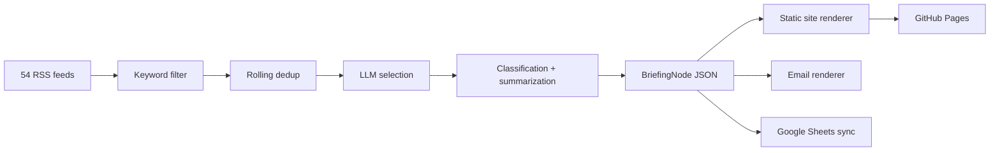

<div align="center">

# Game Legal Briefing

**Open-source regulatory intelligence for the game industry**

<p>
  
  
  
  
  
</p>

**[Quick Start](#quick-start)** · **[Architecture](#architecture)** · **[Deployment](#deployment-model)** · **[Roadmap](#roadmap)**

**Language:** [**English**](README.md) | [한국어](docs/ko/README.md)

</div>

---

## Overview

`Game Legal Briefing` tracks legal, regulatory, platform-policy, privacy, competition, and enforcement developments that matter to game companies, legal teams, and policy watchers.

It starts with RSS collection across industry media, tech-policy coverage, Korean tech press, and BigLaw feeds. Each article is filtered, deduplicated, enriched into structured legal metadata, persisted as JSON, and then rendered into a static briefing site that can also be sent by email or logged to Google Sheets.

> [!IMPORTANT]
> This repository is not a law firm product, and it is not legal advice. It is an open-source workflow for structured monitoring and briefing.

## Why This Exists

Most open-source news briefers stop at headlines and summaries. `Game Legal Briefing` is built around a different primitive: a **structured legal event node**.

That means each story can become something queryable:

- jurisdiction
- category
- regulatory phase
- event type
- actors
- regulated object
- action
- game mechanic

Over time, that turns a mailing list into a browsable regulatory memory for the game industry.

## What It Produces

| Layer | Output | Purpose |
|:------|:-------|:--------|
| **Collection** | Raw RSS articles | Gather candidate stories from 54 feeds |
| **Intelligence** | Structured legal metadata | Convert article text into reusable briefing nodes |
| **Storage** | `output/data/daily/*.json` | Preserve a day-level archive and dedup history |
| **Publishing** | Latest page, archive, detail pages | Create a static site for GitHub Pages |
| **Delivery** | Email HTML + Sheets rows | Push the same briefing into operational channels with BCC-safe recipient delivery |

## Project Status

> [!NOTE]
> The MVP foundation is in place and locally runnable today.
>
> Completed:
> config loading, data models, feed ingestion, keyword filtering, dedup, LLM abstraction, classification, summarization, JSON storage, static rendering, email/sheets seams, GitHub Actions workflow, English/Korean docs split, and a sample-data path for local development.
>
> Still pending for full live operation:
> one real secrets-backed production run, GitHub repo publishing, and future `tier_c` non-RSS source scraping.

## Feature Snapshot

| Capability | Current State |
|:-----------|:--------------|
| **Feed universe** | 54 feeds ported from v1 (`tier_a` 40 + `tier_b` 14) |
| **Dedup model** | URL hash, topic-token similarity, cross-run index, event-key dedup |
| **Metadata model** | `Jurisdiction`, `EventType`, `RegulatoryPhase`, `LegalEvent`, `BriefingNode` |
| **LLM providers** | Gemini via `google-genai`, Claude fallback |
| **Rendering** | Latest page, dated archive pages, article detail pages |
| **Delivery** | Gmail SMTP HTML email with BCC-safe delivery, Google Sheets append |
| **Automation** | Mon/Wed/Fri GitHub Actions workflow + GitHub Pages artifact deploy |
| **Local dev** | `--sample-data` mode works without live API keys |

## Sample Briefing Node

```json
{
  "category": "CONSUMER_MONETIZATION",
  "summary_ko": [
    "EU에서 루트박스 규제 관련 움직임이 포착됐다.",
    "게임사 실무에 미칠 영향과 후속 집행 가능성을 함께 볼 필요가 있다.",
    "원문 확인 후 대응 우선순위를 정리하기 좋은 이슈다."
  ],
  "event": {
    "jurisdiction": "EU",
    "event_type": "legislation",
    "regulatory_phase": "enacted",
    "actors": ["EU regulators"],
    "object": "loot box mechanics",
    "action": "advanced or published new rules",
    "game_mechanic": "loot_box"
  }
}
```

## Quick Start

### 1. Create a virtual environment

```bash
python3 -m venv .venv
./.venv/bin/pip install -r requirements.txt
```

### 2. Prepare environment variables

```bash
cp .env.example .env
```

Fill `.env` with the keys you want to use. For a first look, you can skip this and use sample mode.

### 3. Generate a local sample briefing

```bash
./.venv/bin/python main.py --dry-run --sample-data
```

### 4. Open the generated output

Key artifacts:

- `output/index.html`
- `output/archive/index.html`
- `output/article/*.html`
- `output/data/daily/*.json`

## Running the Real Pipeline

Once your environment variables are set:

```bash
./.venv/bin/python main.py
```

Useful variants:

```bash
./.venv/bin/python main.py --dry-run
./.venv/bin/python main.py --dry-run --sample-data
```

## Configuration

### Non-secret config

`config.yaml` stores:

- LLM provider and model
- feed lists
- keyword allowlist
- dedup retention window
- site base URL
- email subject prefix

### Secrets

`.env.example` documents the environment variables used by the pipeline:

- `GOOGLE_API_KEY`
- `ANTHROPIC_API_KEY`
- `SMTP_USER`
- `SMTP_PASS`
- `RECIPIENTS`
- `GOOGLE_SHEETS_CREDENTIALS`
- `GOOGLE_SHEETS_ID`

## Architecture



### Repository Shape

```text
game-legal-briefing/
├── main.py
├── config.yaml
├── pipeline/
│   ├── sources/        # RSS collection + filters
│   ├── intelligence/   # selector, classifier, summarizer, dedup
│   ├── llm/            # provider interface + Gemini/Claude
│   ├── store/          # daily JSON, dedup index, querying
│   ├── render/         # site + email rendering
│   ├── deliver/        # SMTP delivery
│   └── admin/          # Google Sheets sync
├── templates/
├── static/
├── tests/
└── output/
```

## Deployment Model

The repository includes a GitHub Actions workflow that:

1. runs on **Mon/Wed/Fri**
2. executes the pipeline
3. commits `output/data/` back to `main`
4. deploys rendered `output/` as a GitHub Pages artifact

This keeps structured archives versioned in the repository while keeping rendered pages out of git history.

## Design Direction

The project intentionally avoids generic dashboard aesthetics. The generated site is meant to feel closer to an editorial briefing surface than a SaaS admin panel:

- warm neutral backgrounds
- strong serif headlines
- compact metadata chips
- archive-first structure
- mobile-readable article cards

## Development Notes

- The Gemini provider has already been migrated to the official `google-genai` SDK.
- The sample-data path uses a local heuristic fallback so the project can be demonstrated without secrets.
- The sample mode is repeatable on the same date and does not poison the rolling dedup index.

## Roadmap

| Stage | Focus |
|:------|:------|
| **Now** | Real GitHub repo publish, secrets wiring, first live run |
| **Next** | `tier_c` government and regulator scrapers without RSS |
| **Later** | English summaries, richer archive pages, topic timelines, jurisdiction pulse |
| **Future** | Cross-jurisdiction event linking and feed views by topic or phase |

## Verification

Current local verification:

```bash
./.venv/bin/python -m pytest tests -q
./.venv/bin/python main.py --dry-run --sample-data
```

The test suite currently passes, and the sample command generates a complete briefing site locally.
