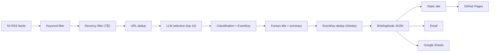

<div align="center">

# Game Legal Briefing

**Open-source regulatory intelligence for the game industry**

<p>
  
  
  
  
</p>

**[브리핑 수신만 하고 싶다면](#브리핑-수신)** · **[직접 운영하기](#직접-운영하기)** · **[Architecture](#architecture)** · **[Roadmap](#roadmap)**

**Language:** [**English**](README.md) | [한국어](docs/ko/README.md)

</div>

---

## What This Does

게임 산업 미디어, 테크 정책 매체, 한국 IT 언론, 글로벌 로펌 블로그 등 54개 RSS 피드에서 기사를 수집합니다. 법률/규제 관련성으로 필터링하고, 중복을 제거한 뒤, AI(Gemini)로 구조화된 메타데이터를 분류하고 한국어로 요약합니다. 정적 브리핑 사이트 + 이메일로 발행합니다.

> [!IMPORTANT]
> 법률 자문이 아닙니다. 규제 모니터링을 위한 오픈소스 도구입니다.

## Why

엔터프라이즈 RegTech(CUBE, Regology, Compliance.ai)은 연 5천만~5억원 이상이고 은행/제약 대상입니다. 게임 산업 변호사가 여러 국가의 규제 변화를 추적할 수 있는 오픈소스 도구는 없었습니다.

대부분의 뉴스 브리퍼는 헤드라인과 요약에서 멈춥니다. 이 프로젝트는 모든 기사에 **구조화된 법률 메타데이터**를 붙입니다:

| Field | Example |
|-------|---------|
| Jurisdiction | EU, KR, US, JP, UK, AU, CN |
| Category | Consumer monetization, age rating, privacy, IP |
| Regulatory phase | Proposed, public comment, enacted, enforced, litigation |
| Event Key | `eu_lootbox_transparency_directive_2026` |
| Game mechanic | Loot box, age rating, data collection |

시간이 지나면 메일링 리스트가 게임 산업 규제 아카이브가 됩니다.

---

## 브리핑 수신

**직접 운영할 필요 없이 브리핑만 받고 싶다면:**

현재 월/수/금 오전 10시(KST)에 게임 산업 규제 브리핑을 이메일로 발송하고 있습니다. 수신을 원하시면 작성자에게 이메일 주소를 알려주세요.

- GitHub: [@lowtidebuild](https://github.com/lowtidebuild)
- 웹 아카이브: [lowtidebuild.github.io/game-legal-briefing](https://lowtidebuild.github.io/game-legal-briefing/)

수신자 목록에 추가해드리면 다음 발송 시점부터 브리핑이 도착합니다. 비용은 없습니다.

---

## 직접 운영하기

이 프로젝트를 fork해서 자체 브리핑 파이프라인을 운영하고 싶다면 아래 단계를 따라주세요.

### 1단계: 설치

```bash
git clone https://github.com/lowtidebuild/game-legal-briefing.git
cd game-legal-briefing
python3 -m venv .venv
source .venv/bin/activate
pip install -r requirements.txt
```

### 2단계: 샘플 브리핑으로 테스트

API 키 없이 먼저 돌려볼 수 있습니다:

```bash
python main.py --dry-run --sample-data
open output/index.html
```

### 3단계: API 키 설정

```bash
cp .env.example .env
```

`.env` 파일을 열고 필요한 값을 채웁니다:

| 변수 | 용도 | 필수 |
|------|------|------|
| `GOOGLE_API_KEY` | Gemini API 키 ([발급](https://aistudio.google.com/apikey)) | **필수** |
| `ANTHROPIC_API_KEY` | Claude API 키 (자동 폴백용) | 선택 |
| `SMTP_USER` | Gmail 주소 (예: `you@gmail.com`) | 이메일 발송시 |
| `SMTP_PASS` | Gmail 앱 비밀번호 (16자리, 공백 포함) | 이메일 발송시 |
| `RECIPIENTS` | 수신자 이메일 (콤마 구분) | 이메일 발송시 |
| `GOOGLE_SHEETS_CREDENTIALS` | Sheets 서비스 계정 JSON | Sheets 연동시 |
| `GOOGLE_SHEETS_ID` | 스프레드시트 ID | Sheets 연동시 |

> **최소 `GOOGLE_API_KEY`만 있으면 파이프라인이 돌아갑니다.** 이메일과 Sheets는 미설정시 자동 스킵됩니다.

### 4단계: 라이브 실행

```bash
python main.py --dry-run   # 사이트만 생성 (이메일/Sheets 스킵)
python main.py              # 전체 실행 (이메일 + Sheets 포함)
```

출력물:
- `output/index.html` — 최신 브리핑
- `output/archive/` — 날짜별 아카이브
- `output/article/` — 개별 기사 페이지
- `output/data/daily/*.json` — 구조화된 데이터

### 5단계: GitHub Actions 자동화

Fork한 repo에서 자동 발송을 설정하려면:

1. **GitHub Secrets 등록:** repo Settings → Secrets and variables → Actions에서 위 환경변수를 Secret으로 등록
2. **GitHub Pages 활성화:** repo Settings → Pages → Source를 "GitHub Actions"로 선택
3. **자동 실행 확인:** 월/수/금 KST 10:07에 자동 실행 (수동 실행: Actions 탭 → Run workflow)

### Google Sheets 연동 (선택)

Sheets는 관리자 로그 + EventKey 기반 중복 제거 DB 역할을 합니다.

1. [Google Cloud Console](https://console.cloud.google.com) → APIs & Services → Library → "Google Sheets API" Enable
2. IAM & Admin → Service Accounts → 서비스 계정 생성 → Keys → JSON 다운로드
3. 스프레드시트 생성 → 서비스 계정 이메일에 편집자 권한 공유
4. GitHub Secrets에 `GOOGLE_SHEETS_CREDENTIALS` (JSON 내용 전체) + `GOOGLE_SHEETS_ID` (URL에서 추출) 등록

기존 아카이브를 Sheets에 backfill하려면:
```bash
GOOGLE_SHEETS_CREDENTIALS='path/to/credentials.json' \
GOOGLE_SHEETS_ID='your-spreadsheet-id' \
python scripts/backfill_sheets.py
```

### Gmail 앱 비밀번호 발급

1. [Google 계정 보안](https://myaccount.google.com/security) → 2단계 인증 활성화
2. 앱 비밀번호 생성 → 16자리 비밀번호 복사
3. `SMTP_USER`에 Gmail 주소 전체(`you@gmail.com`), `SMTP_PASS`에 16자리 (공백 포함) 입력

---

## Pipeline



## Dedup 전략

3단계 중복 제거로 같은 기사/사건이 반복 발송되지 않습니다:

| 단계 | 방식 | 설명 |
|------|------|------|
| 1 | URL hash | 동일 URL 제거 (JSON index, 30일 rolling) |
| 2 | Topic tokens | 제목 단어 기반 유사도 (같은 기사 다른 URL) |
| 3 | EventKey | LLM이 생성한 사건 식별자 (`eu_lootbox_directive_2026`), Google Sheets가 authority |

EventKey는 사람이 Sheets에서 확인/수정할 수 있어서, LLM이 다르게 생성한 키도 수동으로 통합할 수 있습니다.

## Architecture

```text
game-legal-briefing/
├── main.py                 # Pipeline entry point
├── config.yaml             # Non-secret config (54 RSS sources)
├── pipeline/
│   ├── sources/            # RSS collection, keyword/recency filter
│   ├── intelligence/       # Selection, classification, summarization, dedup
│   ├── llm/                # Provider abstraction (Gemini default, Claude fallback)
│   ├── store/              # JSON storage, dedup index, query
│   ├── render/             # Site + email rendering (Jinja2)
│   ├── deliver/            # Gmail SMTP delivery
│   └── admin/              # Google Sheets sync + EventKey read
├── templates/              # Web + email Jinja2 templates
├── static/                 # CSS (Pretendard + Noto Serif KR)
├── scripts/                # One-time utilities (backfill_sheets.py)
├── tests/                  # pytest (47 tests)
└── output/                 # Generated site + data (GitHub Pages)
```

## Tests

```bash
python -m pytest tests -q                  # 47 unit tests
python main.py --dry-run --sample-data     # Integration check (no API keys needed)
```

## Roadmap

| Stage | Focus |
|:------|:------|
| **Done** | MVP pipeline, 54 feeds, Gemini+Claude fallback, EventKey dedup, Korean titles, category grouping, Sheets admin, GitHub Pages, email delivery |
| **Next** | Tier C scrapers (government RSS 없는 사이트), v1 아카이브 EventKey 정규화 |
| **Later** | English summaries, Jurisdiction Pulse dashboard, topic timelines |
| **Future** | Cross-jurisdiction event linking, per-topic/phase RSS feeds |

## License

Apache 2.0
