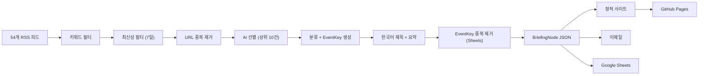

<div align="center">

# Game Legal Briefing

**게임 산업 규제 동향을 자동으로 수집·분류·발송하는 오픈소스 브리핑 도구**

<p>
  
  
  
  
</p>

**[브리핑 수신](#브리핑-수신)** · **[직접 운영하기](#직접-운영하기)** · **[구조](#구조)** · **[로드맵](#로드맵)**

**Language:** [English](../../README.md) | [**한국어**](README.md)

</div>

---

## 뭘 하는 프로젝트인가

게임 업계 미디어, 글로벌 로펌 블로그, 테크 정책 매체, 국내 IT 언론 등 54개 RSS 피드를 돌면서 기사를 긁어옵니다. 게임 법률·규제 관련 기사만 추려서 AI(Gemini)가 메타데이터를 붙이고 한국어로 요약한 다음, 웹사이트 + 이메일로 보내줍니다.

> [!IMPORTANT]
> 법률 자문이 아닙니다. 규제 동향 모니터링용 오픈소스 도구입니다.

## 왜 만들었나

기업용 RegTech(CUBE, Regology 등)은 은행·제약 대상이고 연 수천만 원 이상입니다. 게임 업계 법무팀이 여러 나라 규제 변화를 한눈에 볼 수 있는 도구가 없었습니다.

보통 뉴스 브리퍼는 헤드라인 + 요약에서 끝납니다. 이 프로젝트는 기사마다 **구조화된 메타데이터**를 달아줍니다:

| 항목 | 예시 |
|------|------|
| 관할권 | EU, 한국, 미국, 일본, 영국 등 |
| 카테고리 | 과금/소비자, 연령등급, 개인정보, IP, AI 등 |
| 규제 단계 | 발의 → 공개의견 → 확정 → 집행 → 소송 |
| 사건 식별자 | `eu_lootbox_transparency_directive_2026` |
| 게임 메커닉 | 루트박스, 연령등급, 데이터수집 등 |

쌓이면 쌓일수록 단순 메일링이 아니라 게임 산업 규제 아카이브가 됩니다.

---

## 브리핑 수신

**직접 운영하고 싶지 않고 브리핑만 받고 싶다면:**

매주 월·수·금 오전 10시에 이메일로 발송합니다. 수신을 원하시면 아래로 이메일 주소를 알려주세요.

- GitHub: [@lowtidebuild](https://github.com/lowtidebuild)
- 웹 아카이브: [lowtidebuild.github.io/game-legal-briefing](https://lowtidebuild.github.io/game-legal-briefing/)

다음 발송분부터 도착합니다. 무료입니다.

---

## 직접 운영하기

이 프로젝트를 fork해서 본인만의 브리핑 파이프라인을 돌리고 싶다면 아래 순서대로 하면 됩니다.

### 1. 설치

```bash
git clone https://github.com/lowtidebuild/game-legal-briefing.git
cd game-legal-briefing
python3 -m venv .venv
source .venv/bin/activate
pip install -r requirements.txt
```

### 2. 샘플 브리핑으로 구조 확인

API 키 없이 한번 돌려볼 수 있습니다:

```bash
python main.py --dry-run --sample-data
open output/index.html
```

### 3. API 키 세팅

```bash
cp .env.example .env
```

`.env` 파일을 열고 값을 채웁니다:

| 변수 | 용도 | 필수 여부 |
|------|------|----------|
| `GOOGLE_API_KEY` | Gemini API 키 ([여기서 발급](https://aistudio.google.com/app/apikey)) | **필수** |
| `GROQ_API_KEY` | Groq API 키 (다른 프로바이더 구성 시) | 선택 |
| `ANTHROPIC_API_KEY` | Claude API 키 (이전 구성용) | 선택 |
| `SMTP_USER` | Gmail 주소 (`you@gmail.com` 전체) | 이메일 쓸 때 |
| `SMTP_PASS` | Gmail 앱 비밀번호 (16자리, 공백 포함 그대로) | 이메일 쓸 때 |
| `RECIPIENTS` | 수신자 이메일 목록 (콤마로 구분) | 이메일 쓸 때 |
| `GOOGLE_SHEETS_CREDENTIALS` | Sheets 서비스 계정 JSON | Sheets 쓸 때 |
| `GOOGLE_SHEETS_ID` | 스프레드시트 ID | Sheets 쓸 때 |

> **현재 LLM 구성은 `GOOGLE_API_KEY`만 있으면 동작합니다.** 선별·분류는 Gemini 3.5 Flash `low`, 요약은 같은 모델의 `minimal`을 쓰고, 실패하면 Gemini 3.1 Flash-Lite로 전환합니다. Gemini 무료 등급 한도는 적용됩니다. 이메일과 Sheets는 설정 안 하면 자동 스킵합니다.

### 4. 실행

```bash
python main.py --dry-run   # 사이트만 생성 (이메일/Sheets 안 보냄)
python main.py              # 전체 실행 (이메일 + Sheets 포함)
```

결과물:
- `output/index.html` — 최신 브리핑
- `output/archive/` — 날짜별 아카이브
- `output/article/` — 개별 기사 페이지
- `output/data/daily/*.json` — 구조화된 JSON 데이터

### 5. GitHub Actions 자동화

fork한 repo에서 자동 발송을 세팅하려면:

1. **GitHub Secrets 등록:** repo Settings → Secrets and variables → Actions → 위 환경변수를 Secret으로 추가
2. **GitHub Pages 켜기:** repo Settings → Pages → Source를 "GitHub Actions"로 선택
3. **자동 실행:** 월/수/금 오전 10:07(KST)에 자동 실행됨 (수동: Actions 탭 → Run workflow)

### Google Sheets 연동 (선택사항)

Sheets는 두 가지 역할을 합니다: (1) 관리자가 기사를 확인·수정·삭제하는 로그, (2) EventKey 기반 중복 제거의 기준 DB.

1. [Google Cloud Console](https://console.cloud.google.com) → APIs & Services → Library → "Google Sheets API" 사용 설정
2. IAM & Admin → Service Accounts → 계정 만들기 → Keys 탭 → JSON 다운로드
3. 스프레드시트 새로 만들고 → 서비스 계정 이메일에 편집자 권한 공유
4. GitHub Secrets에 `GOOGLE_SHEETS_CREDENTIALS` (JSON 내용 전체 붙여넣기) + `GOOGLE_SHEETS_ID` (스프레드시트 URL에서 `/d/` 뒤의 문자열) 등록

기존 아카이브를 Sheets에 한번에 넣으려면:
```bash
GOOGLE_SHEETS_CREDENTIALS='credentials.json 경로' \
GOOGLE_SHEETS_ID='스프레드시트ID' \
python scripts/backfill_sheets.py
```

### Gmail 앱 비밀번호 발급

1. [Google 계정 보안](https://myaccount.google.com/security) → 2단계 인증 켜기
2. 앱 비밀번호 만들기 → 16자리 비밀번호 복사
3. `SMTP_USER`에 Gmail 주소 전체, `SMTP_PASS`에 16자리(공백 포함) 넣기

---

## 파이프라인



## 중복 제거 전략

세 단계로 같은 기사나 같은 사건이 반복 발송되는 걸 막습니다:

| 단계 | 방식 | 설명 |
|------|------|------|
| 1 | URL 해시 | 같은 URL 제거 (30일 rolling JSON 인덱스) |
| 2 | 제목 토큰 | 제목 단어 기반 유사도 (같은 기사가 다른 URL로 올라온 경우) |
| 3 | EventKey | AI가 생성한 사건 식별자 (`eu_lootbox_directive_2026`), Sheets가 기준 |

Sheets에서 EventKey를 직접 확인하고 수정할 수 있어서, AI가 다르게 생성한 키도 사람이 통합할 수 있습니다.

## 구조

```text
game-legal-briefing/
├── main.py                 # 파이프라인 진입점
├── config.yaml             # 설정 (54개 RSS 소스, 시크릿 없음)
├── pipeline/
│   ├── sources/            # RSS 수집, 키워드/최신성 필터
│   ├── intelligence/       # AI 선별, 분류, 요약, 중복 제거
│   ├── llm/                # 프로바이더 추상화 (Gemini 모델 폴백)
│   ├── store/              # JSON 저장, 중복 인덱스, 쿼리
│   ├── render/             # 사이트 + 이메일 렌더링 (Jinja2)
│   ├── deliver/            # Gmail SMTP 발송
│   └── admin/              # Google Sheets 동기화 + EventKey 읽기
├── templates/              # 웹 + 이메일 Jinja2 템플릿
├── static/                 # CSS (Pretendard + Noto Serif KR)
├── scripts/                # 유틸리티 (backfill_sheets.py)
├── tests/                  # pytest 테스트
└── output/                 # 생성된 사이트 + 데이터 (GitHub Pages)
```

## 테스트

```bash
python -m pytest tests -q                  # 단위 테스트
python main.py --dry-run --sample-data     # 통합 확인 (API 키 불필요)
```

## 로드맵

| 단계 | 내용 |
|:-----|:-----|
| **완료** | MVP 파이프라인, 54개 피드, Gemini 무료 모델 폴백, EventKey 중복 제거, 한국어 제목, 카테고리 그룹핑, Sheets 관리, GitHub Pages, 이메일 발송 |
| **다음** | RSS 없는 정부/규제기관 사이트 스크래퍼, 영문 요약 |
| **이후** | Jurisdiction Pulse 대시보드, 토픽 타임라인 |
| **장기** | 관할권 간 사건 연결, 토픽/단계별 RSS 피드 |

## 라이선스

Apache 2.0
