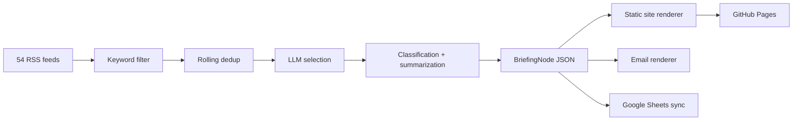

<div align="center">

# Game Legal Briefing

**게임 산업을 위한 오픈소스 규제 인텔리전스 플랫폼**

<p>
  
  
  
  
  
</p>

**[빠른 시작](#빠른-시작)** · **[아키텍처](#아키텍처)** · **[배포 모델](#배포-모델)** · **[로드맵](#로드맵)**

**Language:** [English](../../README.md) | [**한국어**](README.md)

</div>

---

## 개요

`Game Legal Briefing`은 게임 회사, 사내 법무팀, 정책 담당자, 업계 관찰자가 필요로 하는 법률·규제·플랫폼 정책·개인정보·경쟁법·집행 이슈를 추적하기 위해 만든 오픈소스 프로젝트입니다.

이 프로젝트는 게임 업계 미디어, 테크 정책 매체, 국내 IT/게임 언론, 글로벌 로펌 피드를 포함한 RSS 소스에서 후보 기사를 수집한 뒤, 필터링하고, 중복 제거하고, 구조화된 법률 메타데이터로 변환합니다. 그 결과는 JSON으로 저장되고, 정적 브리핑 사이트로 렌더링되며, 필요하면 이메일과 Google Sheets로도 전달할 수 있습니다.

> [!IMPORTANT]
> 이 저장소는 법률 자문을 제공하는 서비스가 아닙니다. 구조화된 모니터링과 브리핑을 위한 오픈소스 워크플로입니다.

## 왜 이 프로젝트인가

대부분의 오픈소스 뉴스 브리퍼는 헤드라인과 요약에서 끝납니다. `Game Legal Briefing`은 그보다 한 단계 더 나아가, 각 기사를 **구조화된 규제 이벤트 노드**로 다룹니다.

그래서 기사 하나가 아래처럼 남습니다.

- 관할
- 카테고리
- 규제 단계
- 이벤트 유형
- 주요 행위자
- 규제 대상 객체
- 발생한 조치
- 관련 게임 메커닉

시간이 지나면 단순 메일링이 아니라, 게임 산업 규제 변화를 추적하는 검색 가능한 기록이 됩니다.

## 무엇을 만드는가

| 레이어 | 산출물 | 역할 |
|:-------|:-------|:-----|
| **수집** | 원시 RSS 기사 | 54개 피드에서 후보 기사 확보 |
| **인텔리전스** | 구조화된 법률 메타데이터 | 기사 텍스트를 재사용 가능한 브리핑 노드로 변환 |
| **저장** | `output/data/daily/*.json` | 날짜별 아카이브와 dedup 기록 유지 |
| **퍼블리싱** | 최신 페이지, 아카이브, 상세 페이지 | GitHub Pages용 정적 사이트 생성 |
| **전달** | 이메일 HTML + Sheets 행 | 같은 브리핑을 운영 채널로 푸시하고, 메일은 수신자 주소가 서로 보이지 않게 전달 |

## 현재 상태

> [!NOTE]
> MVP 기반은 이미 만들어졌고, 로컬에서 실행 가능한 상태입니다.
>
> 완료된 것:
> 설정 로딩, 데이터 모델, 피드 수집, 키워드 필터, dedup, LLM 추상화, 분류, 요약, JSON 저장, 정적 렌더링, 이메일/Sheets 연동 지점, GitHub Actions 워크플로, 영문/국문 README 분리, 샘플 데이터 모드.
>
> 아직 남은 것:
> 실제 비밀값을 넣고 한 번 운영 실행하기, GitHub 공개 저장소로 푸시하기, 그리고 향후 `tier_c` 비RSS 소스 스크래퍼 구현.

## 기능 요약

| 기능 | 현재 상태 |
|:-----|:----------|
| **피드 규모** | v1에서 가져온 54개 피드 (`tier_a` 40 + `tier_b` 14) |
| **중복 제거** | URL 해시, 토픽 토큰 유사도, cross-run index, event-key dedup |
| **메타데이터 모델** | `Jurisdiction`, `EventType`, `RegulatoryPhase`, `LegalEvent`, `BriefingNode` |
| **LLM 제공자** | `google-genai` 기반 Gemini, Claude fallback |
| **렌더링** | 최신 페이지, 날짜별 아카이브, 기사 상세 페이지 |
| **전달 채널** | 수신자 비노출(BCC-safe) Gmail SMTP HTML 메일, Google Sheets append |
| **자동화** | 주 3회 GitHub Actions + GitHub Pages artifact 배포 |
| **로컬 개발** | API 키 없이 `--sample-data` 모드 사용 가능 |

## Sample Briefing Node

```json
{
  "category": "CONSUMER_MONETIZATION",
  "summary_ko": [
    "EU에서 루트박스 규제 관련 움직임이 포착됐다.",
    "게임사 실무에 미칠 영향과 후속 집행 가능성을 함께 볼 필요가 있다.",
    "원문 확인 후 대응 우선순위를 정리하기 좋은 이슈다."
  ],
  "event": {
    "jurisdiction": "EU",
    "event_type": "legislation",
    "regulatory_phase": "enacted",
    "actors": ["EU regulators"],
    "object": "loot box mechanics",
    "action": "advanced or published new rules",
    "game_mechanic": "loot_box"
  }
}
```

## 빠른 시작

### 1. 가상환경 만들기

```bash
python3 -m venv .venv
./.venv/bin/pip install -r requirements.txt
```

### 2. 환경 변수 준비

```bash
cp .env.example .env
```

`.env`에 필요한 키를 채우면 됩니다. 먼저 구조만 보고 싶다면 비워둔 채 샘플 모드로 시작해도 됩니다.

### 3. 샘플 브리핑 생성

```bash
./.venv/bin/python main.py --dry-run --sample-data
```

### 4. 생성 결과 확인

주요 결과물:

- `output/index.html`
- `output/archive/index.html`
- `output/article/*.html`
- `output/data/daily/*.json`

## 실제 파이프라인 실행

환경 변수를 채운 뒤에는 아래처럼 실행합니다.

```bash
./.venv/bin/python main.py
```

자주 쓰는 변형:

```bash
./.venv/bin/python main.py --dry-run
./.venv/bin/python main.py --dry-run --sample-data
```

## 설정

### 비밀값이 아닌 설정

`config.yaml`에는 아래가 들어갑니다.

- LLM provider와 model
- 피드 목록
- 키워드 allowlist
- dedup 보존 기간
- 사이트 base URL
- 이메일 제목 prefix

### 비밀값

`.env.example`에 아래 환경 변수들이 정리되어 있습니다.

- `GOOGLE_API_KEY`
- `ANTHROPIC_API_KEY`
- `SMTP_USER`
- `SMTP_PASS`
- `RECIPIENTS`
- `GOOGLE_SHEETS_CREDENTIALS`
- `GOOGLE_SHEETS_ID`

## 아키텍처



### 저장소 구조

```text
game-legal-briefing/
├── main.py
├── config.yaml
├── pipeline/
│   ├── sources/        # RSS 수집 + 필터
│   ├── intelligence/   # selector, classifier, summarizer, dedup
│   ├── llm/            # provider interface + Gemini/Claude
│   ├── store/          # daily JSON, dedup index, query
│   ├── render/         # site + email rendering
│   ├── deliver/        # SMTP delivery
│   └── admin/          # Google Sheets sync
├── templates/
├── static/
├── tests/
└── output/
```

## 배포 모델

저장소에는 GitHub Actions 워크플로가 포함되어 있고, 이 워크플로는:

1. **월/수/금**에 실행되고
2. 파이프라인을 돌린 다음
3. `output/data/`는 `main`에 커밋하고
4. 렌더된 `output/`은 GitHub Pages artifact로 배포합니다

즉, 구조화된 아카이브는 git 히스토리에 남기고, 렌더된 HTML은 Pages 쪽으로만 배포하는 모델입니다.

## 디자인 방향

생성 사이트는 흔한 SaaS 대시보드 느낌보다 에디토리얼 브리핑 감각에 가깝게 설계했습니다.

- 따뜻한 뉴트럴 배경
- 강한 serif 헤드라인
- 밀도 높은 메타데이터 칩
- archive-first 구조
- 모바일에서도 읽히는 기사 카드

## 개발 메모

- Gemini provider는 이미 공식 `google-genai` SDK로 옮겨둔 상태입니다.
- 샘플 모드는 로컬 heuristic fallback을 사용해서 비밀값 없이도 데모가 가능합니다.
- 샘플 모드는 같은 날짜에 반복 실행해도 dedup index에 오염되지 않도록 처리했습니다.

## 로드맵

| 단계 | 초점 |
|:-----|:-----|
| **지금** | 실제 GitHub 저장소 publish, secrets 연결, 첫 live run |
| **다음** | RSS가 없는 `tier_c` 정부/규제기관 스크래퍼 |
| **그 다음** | 영문 요약, 더 풍부한 archive 페이지, topic timeline, jurisdiction pulse |
| **장기** | 관할 간 이벤트 연결, 토픽/단계별 피드 뷰 |

## 검증

현재 로컬 검증 명령:

```bash
./.venv/bin/python -m pytest tests -q
./.venv/bin/python main.py --dry-run --sample-data
```

테스트는 현재 통과 상태이고, 샘플 명령으로 전체 브리핑 사이트를 로컬 생성할 수 있습니다.
