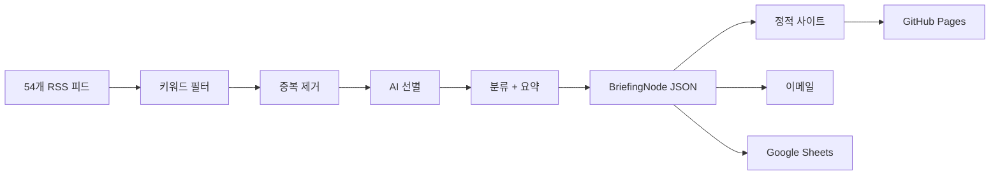

<div align="center">

# Game Legal Briefing

**게임 업계 법률·규제 동향을 자동으로 수집하고 정리하는 오픈소스 브리핑 도구**

<p>
  
  
  
  
</p>

**[시작하기](#시작하기)** · **[구조](#구조)** · **[배포](#배포)** · **[로드맵](#로드맵)**

**Language:** [English](../../README.md) | [**한국어**](README.md)

</div>

---

## 이 프로젝트가 하는 일

게임 업계 미디어, 테크 정책 매체, 국내 IT/게임 언론, 글로벌 로펌 블로그 등 54개 RSS 피드에서 기사를 수집합니다. 수집된 기사 중 게임 법률·규제와 관련 있는 것만 골라서 AI(Gemini)로 분류하고 한국어로 요약한 뒤, 정적 웹사이트와 이메일로 전달합니다.

> [!IMPORTANT]
> 이 프로젝트는 법률 자문이 아닙니다. 규제 동향 모니터링을 위한 오픈소스 도구입니다.

## 왜 만들었나

기존 RegTech 솔루션(CUBE, Regology 등)은 금융·제약 중심이고, 연 수천만 원 이상입니다. 게임 업계 법무팀을 위한 전문 도구는 없었습니다.

이 프로젝트는 단순 뉴스 요약을 넘어서, 기사마다 **구조화된 메타데이터**를 붙입니다:

| 필드 | 예시 |
|------|------|
| 관할권 | EU, KR, US, JP 등 |
| 카테고리 | 소비자 과금, 연령 등급, 개인정보, IP 등 |
| 규제 단계 | 발의, 공개 의견 수렴, 확정, 집행, 소송 |
| 관련 주체 | EU Commission, Nintendo, FTC 등 |
| 게임 메커닉 | 루트박스, 연령 등급, 데이터 수집 등 |

시간이 쌓이면 단순 메일링이 아니라, 게임 산업 규제 변화의 검색 가능한 아카이브가 됩니다.

## 현재 상태

> [!NOTE]
> MVP 구현이 완료되어 로컬에서 실행 가능한 상태입니다.
>
> **완료:** 설정, 데이터 모델, RSS 수집, 키워드 필터, 중복 제거, LLM 추상화(Gemini/Claude), 분류, 요약, JSON 저장, 정적 사이트 렌더링, 이메일/Sheets 연동, GitHub Actions, 샘플 데이터 모드
>
> **남은 작업:** 실제 시크릿 연결 후 운영 실행, GitHub 공개 저장소 퍼블리시, tier_c 비RSS 소스 스크래퍼

## 파이프라인 흐름



## 브리핑 노드 예시

```json
{
  "category": "CONSUMER_MONETIZATION",
  "summary_ko": [
    "EU에서 루트박스 규제 관련 움직임이 포착됐다.",
    "게임사 실무에 미칠 영향과 후속 집행 가능성을 함께 볼 필요가 있다.",
    "원문 확인 후 대응 우선순위를 정리하기 좋은 이슈다."
  ],
  "event": {
    "jurisdiction": "EU",
    "event_type": "legislation",
    "regulatory_phase": "enacted",
    "actors": ["EU regulators"],
    "object": "loot box mechanics",
    "action": "advanced or published new rules",
    "game_mechanic": "loot_box"
  }
}
```

## 시작하기

### 1. 설치

```bash
python3 -m venv .venv
./.venv/bin/pip install -r requirements.txt
```

### 2. 환경 변수

```bash
cp .env.example .env
# .env 파일에 API 키 등을 채워 넣으세요
# 먼저 구조만 확인하고 싶다면 비워둔 채로 샘플 모드를 쓸 수 있습니다
```

### 3. 샘플 브리핑 생성

```bash
./.venv/bin/python main.py --dry-run --sample-data
```

### 4. 결과 확인

- `output/index.html` — 최신 브리핑
- `output/archive/index.html` — 날짜별 아카이브
- `output/article/*.html` — 기사 상세
- `output/data/daily/*.json` — 구조화된 데이터

### 실제 운영 실행

환경 변수를 채운 뒤:

```bash
./.venv/bin/python main.py          # 전체 실행 (이메일 + Sheets 포함)
./.venv/bin/python main.py --dry-run # 이메일/Sheets 없이 사이트만 생성
```

## 설정

**config.yaml** — 코드에 커밋되는 설정 (시크릿 없음):
- LLM 프로바이더/모델명, RSS 피드 목록, 키워드 목록
- 중복 제거 보존 기간, 사이트 base URL, 이메일 제목

**환경 변수** — `.env` 또는 GitHub Secrets:

| 변수 | 용도 |
|------|------|
| `GOOGLE_API_KEY` | Gemini API |
| `ANTHROPIC_API_KEY` | Claude API (선택) |
| `SMTP_USER` / `SMTP_PASS` | Gmail 발송 |
| `RECIPIENTS` | 수신자 목록 (쉼표 구분) |
| `GOOGLE_SHEETS_CREDENTIALS` | Sheets 서비스 계정 JSON |
| `GOOGLE_SHEETS_ID` | Sheets 스프레드시트 ID |

## 구조

```text
game-legal-briefing/
├── main.py                 # 파이프라인 실행 진입점
├── config.yaml             # 설정 (시크릿 없음)
├── pipeline/
│   ├── sources/            # RSS 수집, 키워드 필터
│   ├── intelligence/       # AI 선별, 분류, 요약, 중복 제거
│   ├── llm/                # LLM 추상화 (Gemini/Claude)
│   ├── store/              # JSON 저장, 중복 인덱스, 쿼리
│   ├── render/             # 사이트 + 이메일 렌더링
│   ├── deliver/            # SMTP 발송
│   └── admin/              # Google Sheets 동기화
├── templates/              # Jinja2 템플릿
├── static/                 # CSS
├── tests/                  # pytest
└── output/                 # 생성된 사이트 + 데이터
```

## 배포

GitHub Actions 워크플로가 **월/수/금** 자동으로:

1. 파이프라인 실행
2. 분류/요약된 JSON 데이터를 `main` 브랜치에 커밋
3. 렌더링된 HTML을 GitHub Pages로 배포

JSON 아카이브는 git 히스토리에 남고, HTML은 Pages에만 배포되어 레포가 불필요하게 커지지 않습니다.

## 디자인

SaaS 대시보드가 아닌, 에디토리얼 브리핑 느낌으로 만들었습니다:
- 따뜻한 아이보리 배경 (#FAFAF8)
- 깔끔한 타이포그래피, 모바일 우선 (720px)
- 카테고리 칩, 관할권 태그, 규제 단계 뱃지
- 아카이브 중심 네비게이션

## 테스트

```bash
./.venv/bin/python -m pytest tests -q               # 단위 테스트
./.venv/bin/python main.py --dry-run --sample-data   # 통합 확인
```

## 로드맵

| 단계 | 내용 |
|:-----|:-----|
| **현재** | GitHub 공개, 시크릿 연결, 첫 운영 실행 |
| **다음** | RSS 없는 정부/규제기관 사이트 스크래퍼 (tier_c) |
| **이후** | 영문 요약, 토픽 타임라인, Jurisdiction Pulse 대시보드 |
| **장기** | 관할권 간 규제 연관 관계, 토픽/단계별 피드 |

## 라이선스

Apache 2.0
